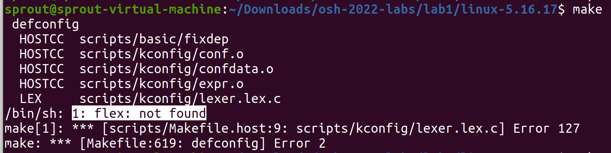

# Lab1 实验记录

之所以叫记录不叫报告是因为根本就没让交嘛……

PB20111686 黄瑞轩

## Linux 编译

在 [kernel.org](https://www.kernel.org/) 上可以下载到 Linux 内核的源代码。

> 此次实验，我们选择最新的稳定版，Linux 5.16.17 的内核进行编译。
>
> ~~（实验发布当天最新的稳定版变成了 5.16.18）~~
>
> 为了和实验文档一致，这里还是选择 5.16.17，新版本以后再体验8！

下载好 linux-5.16.17.tar.xz 文件后，解压缩为文件夹 linux-5.16.17。

> 使用`tar`命令来解压缩，`xz`格式的解压参数是`Jxvf`。
>
> 参数中`x`表示解压，`J`表示解压xz格式的数据，`f`表示指定输入文件

进入后创建默认配置：

```
make defconfig
```

> 这一步报错：
>
> 
>
> 解决方案：`sudo apt-get install flex`和`sudo apt-get install bison -y`
>
> 这两个是干什么用的？

然后使用下列命令之一（推荐前两者），对 Linux 内核进行修改：

```
make xconfig
make menuconfig
make gconfig
make nconfig
```

> 执行第一个命令遇到错误，因为第一个是图形化的，执行第二个可以。
>
> 
>
> https://www.cnblogs.com/klb561/p/9192630.html【各文件夹用途】

初次编译可以不进行修改，体验编译的过程。

最后进行编译，执行：

```
make
```

如果你知道自己的设备有多少 CPU 核心（虚拟核心数，或者说 CPU 线程数，可以自行搜索`超线程`了解含义和区别），可以使用：

```
make -j <cores>
```

`<cores>` 可以自行调节，不大于上述 CPU 虚拟核心数较佳。

> 普通班讲义提示：使用``make -j $((`nproc`-1))``
>
> `nproc`是个shell内置变量，代表CPU核心数。
>
> 如果指令只有`make -j`，后面没有加上处理器核数，那么编译器会无限开多线程。因为 Linux 内核编译十分复杂，这会直接吃满系统资源，导致系统崩溃。

> 编译出来的内核镜像文件存放在源码路径的`arch/x86_64/boot`下，首次编译时间贼几把长而且最后大小有10.3MiB，根据下面调参比赛的要求（bushi），需要尽可能地减小此镜像大小。
>
> 哪些选项是能够真正地、切实地影响编译后的内核大小的？这是要思考的问题。
>
> 我也不知道 反正就一通乱选 最后变成2.6Mb了 但是有Kernel panic出现。

> **2018 OSH 提示：**
>
> 打开64位内核支持：
>
> ```
> [*] 64-bit kernel
> ```
>
> 为了让内核能够打印调试信息，我们需要打开kernel print function的支持：
>
> ```
> -> General setup
>   -> Configure standard kernel features
> [*] Enable support for printk
> ```
>
> 打开内存文件系统的支持：
>
> ```
> -> General setup
> [*] Initial RAM filesystem and RAM disk (initramfs/initrd) support
> ```
>
> 打开ELF可执行文件的支持：
>
> ```
> -> Executable file formats / Emulations
> [*] Kernel support for ELF binaries
> ```
>
> 打开TTY驱动的支持：
>
> ```
> -> Device Drivers
>   -> Character devices
> [*] Enable TTY
> ```
>
> 为了能让QEMU能正常显示终端，需要打开UART串口的支持：
>
> ```
> -> Device Drivers
>   -> Character devices
>     -> Serial drivers
> [*] 8250/16550 and compatible serial support
> [*]   Console on 8250/16550 and compatible serial port
> ```
>
> 为了让标准UNIX工具能够正常工作（如获取启动时间），需要打开`/proc`和`sysfs`文件系统的支持：
>
> ```
> -> File systems
>   -> Pseudo filesystems
> [*] /proc file system support
> [*] sysfs file system support
> ```
>
> 全部设置完成后，请保存修改后退出配置编辑器。

编译完成后可以使用 QEMU 进行测试：

```
qemu-system-x86_64 -kernel linux-5.16.17/arch/x86_64/boot/bzImage
```

重复上述的修改和编译过程，即可进行对于 Linux 内核的删减。

### 评分标准[¶](https://osh-2022.github.io/lab1/#评分标准)

- 提交编译好的内核文件 `bzImage`，保证其能够完成后续实验——1 分
- `bzImage` 文件大小小于 7MiB——1 分
- `bzImage` 文件大小小于 6MiB——1 分
- `bzImage` 文件大小小于 4MiB——1 分

### 提示[¶](https://osh-2022.github.io/lab1/#提示)

此次实验不是调参比赛，**满分可以在只修改前两层选项的情况下轻松达成**，请注意哪些选项是能够真正地、切实地影响编译后的内核大小的。

此环节同时会减少内核编译时间，使得后续浪费在编译上的时间减少。

### 文件路径[¶](https://osh-2022.github.io/lab1/#文件路径)

- 编译好的内核文件：置于 `/lab1/bzImage`
- 编译内核时的配置文件：置于 `/lab1/.config`（可选）

## 创建初始内存盘[¶](https://osh-2022.github.io/lab1/#创建初始内存盘)

Linux 在启动时，会首先加载初始内存盘（initrd，init ram disk）进行初始化的操作。 下面我们讲解如何创建一个最小化的 initrd。

我们首先创建一个 C 程序，代码如下：

```
#include <stdio.h>

int main() {
    printf("Hello, Linux!\n");
    return 0;
}
```

保存为 init.c。

之后编译，**静态链接**为可执行程序：

```
gcc -static init.c -o init
```

创建一个新的目录用于暂存文件。 在新的目录下打包 initrd：

```
find . | cpio --quiet -H newc -o | gzip -9 -n > ../initrd.cpio.gz
```

这会在目录外创建压缩后的 initrd.cpio.gz 初始内存盘。

同样，我们使用 QEMU 测试效果：

```
qemu-system-x86_64 -kernel linux-5.16.17/arch/x86_64/boot/bzImage -initrd initrd.cpio.gz
```

当你在屏幕上看到 "Hello, Linux!" 的时候，就成功了。 如果你看不清输出的信息，又发现无法上翻，可以使用以下指令：

```
qemu-system-x86_64 -kernel linux-5.16.17/arch/x86_64/boot/bzImage -initrd initrd.cpio.gz -nographic -append console=ttyS0
```

注意此命令执行后 Ctrl+C 无法终止，需要关闭 Terminal 或者 kill 对应进程。

### 评分标准[¶](https://osh-2022.github.io/lab1/#评分标准_1)

- 提交编译好的初始内存盘 `initrd.cpio.gz`，保证其能够显示 "Hello, Linux!"——2 分

### 文件路径[¶](https://osh-2022.github.io/lab1/#文件路径_1)

- 编译好的初始内存盘文件：置于 `/lab1/initrd.cpio.gz`

## 添加一个自定义的 Linux syscall[¶](https://osh-2022.github.io/lab1/#添加一个自定义的-linux-syscall)

本节我们将为 Linux 添加一个自定义的 syscall，来获得一串字符串 "Hello, world!\n"。

首先回到 linux 源码文件夹 linux-5.16.17，添加一个文件 `custom/hello.c`：

```
#include <linux/string.h>
#include <linux/syscalls.h>
#include <linux/uaccess.h>

SYSCALL_DEFINE2(hello, char *, buf, size_t, buf_len)
{
    static const char s[] = "Hello, world!\n";
    if (strlen(s) <= buf_len) {
        return copy_to_user(buf, s, sizeof(s));
    } else {
        return -1;
    }
}
```

`SYSCALL_DEFINE2` 就是一个函数定义，此处能够很方便地同时为 32 bit 和 64 bit 声明对应函数。

由于内核态和用户态处于不同的级别下，指针无法直接访问，此处需要使用 `copy_to_user` 把数据从内核态复制到用户态。

此系统调用仅仅是将 "Hello, world!\n" 复制到用户提供的 buffer。

接下来我们将此文件添加到 Linux 的编译过程中。 打开 `Makefile` 文件，找到 `kernel/ certs/ mm/ fs/ ipc/ security/ crypto/` 所在的行，将 `custom/` 也添加到此列表中，变为：

```
<...>
core-y                 += kernel/ certs/ mm/ fs/ ipc/ security/ crypto/ custom/
<...>
```

再在 `custom` 下创建文件 `Makefile`，内容仅为：

```
obj-y := hello.o
```

之后编译时就会将我们自行添加的 `custom/hello.c` 文件纳入到编译和链接中了。

最后来解决 syscall 的部分。 既然我们的架构是 x86_64（或者说 amd64，兼容 x86），打开 `arch/x86/entry/syscalls/syscall_64.tbl` syscall 表文件在最后一行添加一个新 syscall：

```
<...>
548    common  hello   sys_hello
```

记住这个数字 548，之后我们会用此数字来进行调用。

然后在 `include/linux/syscalls.h` 中添加一行声明：

```
// <...>
asmlinkage long sys_hello(char *buf, int buf_len);
// <...>
```

接下来重新编译内核，syscall 就添加完成了。

我们可以用一个 initrd 程序来进行测试。 请自行查询 [`syscall` Linux 文档](https://man7.org/linux/man-pages/man2/syscall.2.html)，编写程序测试以上自行添加的自定义 syscall，使得提供的 buffer 长度在充足和不足时均能输出希望的结果：

- 长度充足时，返回 0，buffer 中存放完整的 "Hello, world!\n"
- 长度不充足时，返回 -1，buffer 中存放不完整的 "Hello, world!\n"

### 评分标准[¶](https://osh-2022.github.io/lab1/#评分标准_2)

- 提交编译好的内核 `bzImage`，保证能够在 buffer 长度充足时完成 syscall——2 分
- 编译好的内核 `bzImage` 也能保证在 buffer 长度不充足时完成 syscall——2 分
- 提交测试 syscall 的 initrd 源代码文件——2 分

### 文件路径[¶](https://osh-2022.github.io/lab1/#文件路径_2)

- 编译好的内核文件：置于 `/lab1/syscall/bzImage`
- 测试 syscall 的源代码文件 `/lab1/syscall/initrd.c`